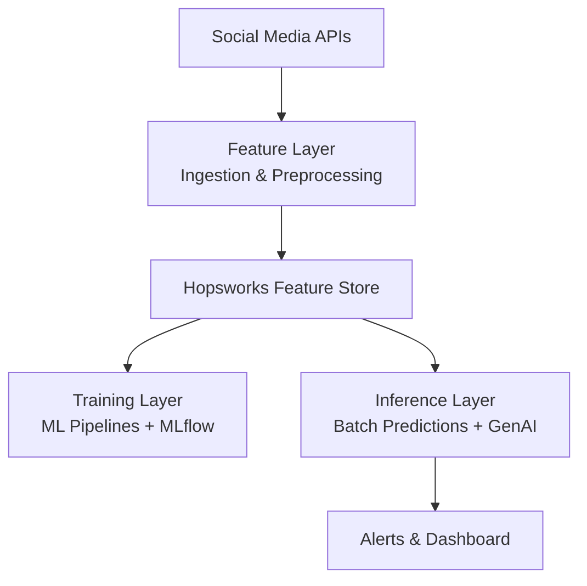

# 🚰 Social Media Monitoring for Water Utilities 🌊  
*An End-to-End MLOps Pipeline using Hopsworks, GenAI, and FTI Architecture*

  
  
  

---

## 📖 Project Overview
This project is an automated **MLOps pipeline** designed to help **water utilities** monitor and analyze public sentiment, service issues, and potential incidents by leveraging **social media data**.

🔹 Runs every **12 hours** to:
- Ingest posts from platforms like **Twitter/X**
- Perform **sentiment analysis**, **NER**, and **anomaly detection**
- Generate **GenAI-powered summaries**
- Trigger alerts and update a live dashboard

> 🎯 Built using modern MLOps practices, this project is also a portfolio piece demonstrating scalable, production-ready AI pipelines with **Hopsworks**, **GitHub Actions**, **Airflow**, and **Docker**.

---

## 🚀 Features
- ✅ Automated social media scraping (Twitter/X)
- ✅ Data preprocessing and feature engineering
- ✅ Centralized **Feature Store** using Hopsworks
- ✅ ML pipeline for Sentiment Analysis & Named Entity Recognition (NER)
- ✅ **GenAI summarization** (OpenAI API)
- ✅ Anomaly detection for complaint spikes
- ✅ Streamlit dashboard for real-time insights
- ✅ Alerts via email for critical issues
- ✅ CI/CD with GitHub Actions
- ✅ Containerized with Docker
- ✅ Orchestrated with Airflow

---

## 🏗️ Architecture

### FTI (Feature, Training, Inference) Design

⚙️ Tech Stack

Category	Tools/Frameworks
Programming	Python 3.10+
MLOps Platform	Hopsworks, MLflow
Orchestration	Apache Airflow, Cron
AI/ML	HuggingFace, spaCy, Scikit-learn
GenAI	OpenAI API
Dashboard	Streamlit
Deployment	Docker, GitHub Actions
Data Versioning	DVC (optional)
📂 Repository Structure
plaintext
Copy
Edit
├── data_ingestion/        # Social media scrapers & ETL scripts
├── feature_store/         # Feature engineering & Hopsworks integration
├── training/              # Model training pipelines (Sentiment, NER)
├── inference/             # Batch inference, GenAI summarization
├── dashboard/             # Streamlit app
├── airflow_dags/          # Orchestration workflows
├── docker/                # Docker configs
├── .github/               # GitHub Actions workflows
├── requirements.txt
├── README.md
└── LICENSE
🚧 Current Status
MVP in Progress
This project is under active development as a part-time initiative. Contributions and feedback are welcome!

📈 How It Works
Ingestion: Pulls relevant posts mentioning the utility every 12 hours.

Feature Layer: Processes text and stores structured data in Hopsworks.

Training Layer: ML models predict sentiment & extract entities.

Inference Layer: Generates summaries, detects anomalies, triggers alerts.

Visualization: Updates dashboard and sends reports.

🛠️ Setup Instructions
1️⃣ Clone the Repo
bash
Copy
Edit
git clone https://github.com/your-username/social-media-water-mlops.git
cd social-media-water-mlops
2️⃣ Install Dependencies
bash
Copy
Edit
pip install -r requirements.txt
3️⃣ Configure API Keys
Create a .env file:

plaintext
Copy
Edit
TWITTER_API_KEY=xxx
REDDIT_CLIENT_ID=xxx
OPENAI_API_KEY=xxx
HOPSWORKS_API_KEY=xxx
EMAIL_SMTP_SERVER=xxx
4️⃣ Run Ingestion Script
bash
Copy
Edit
python data_ingestion/run_ingestion.py
📊 Example Output

🤝 Potential Collaboration
This tool is designed with real-world utility use in mind. If you're a water utility interested in pilot testing, feel free to reach out via LinkedIn or open an issue!

📝 License
This project is licensed under the MIT License.

🙌 Acknowledgments
Hopsworks

HuggingFace Transformers

OpenAI

Twitter Developer Platform

markdown
Copy
Edit
